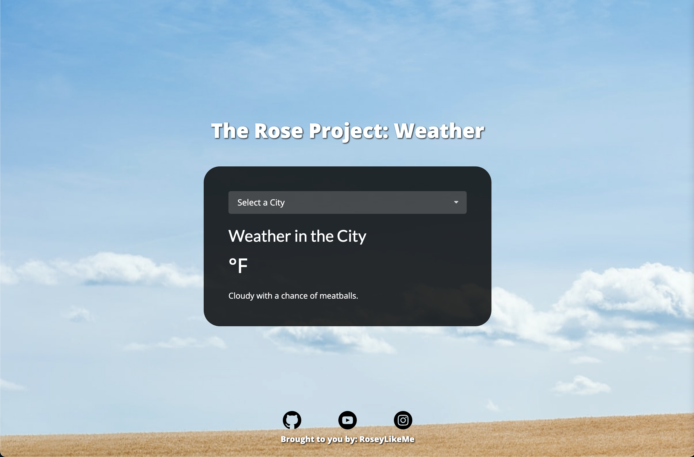

# Weather App from Weather.Gov API

The Rose Project presents a Dynamic weather app using HTML, CSS, and JavaScript. 

Time Spent: ~12 Hours

Check it out: https://roseylikeme.github.io/weather-api

## Description + Goal

I've created The Rose Project to showcase my journey and development in coding. With this particular project, my goal is to 
display the weather forecast for all cities across the US using the US Government's REST API found [here](https://api.weather.gov/).

## Challenges

I've faced a lot of roadblocks in completing this project. My initial roadblock was figuring out how to grab all the cities across
the US with their (lat, long) coordinates. Fetching the data from the API was easy, however learning how to grab the right properties
was the next biggest challenge that took much of my time. Displaying the weather forecast for the upcoming few days was easy, so I decided
to challenge myself and grab a specific forecast –– the current one, and display it.

## What I've Learned

Through building this weather application, I've learned how to utilize APIs to gather data and display it on my webpage. 

- How to utilize Postman to submit GET reqeuests.
- Access array properties & objects within objects ❗️ [oh was that a pain]
- How to create a searchable select dropdown.
- How to change background images with search values.
